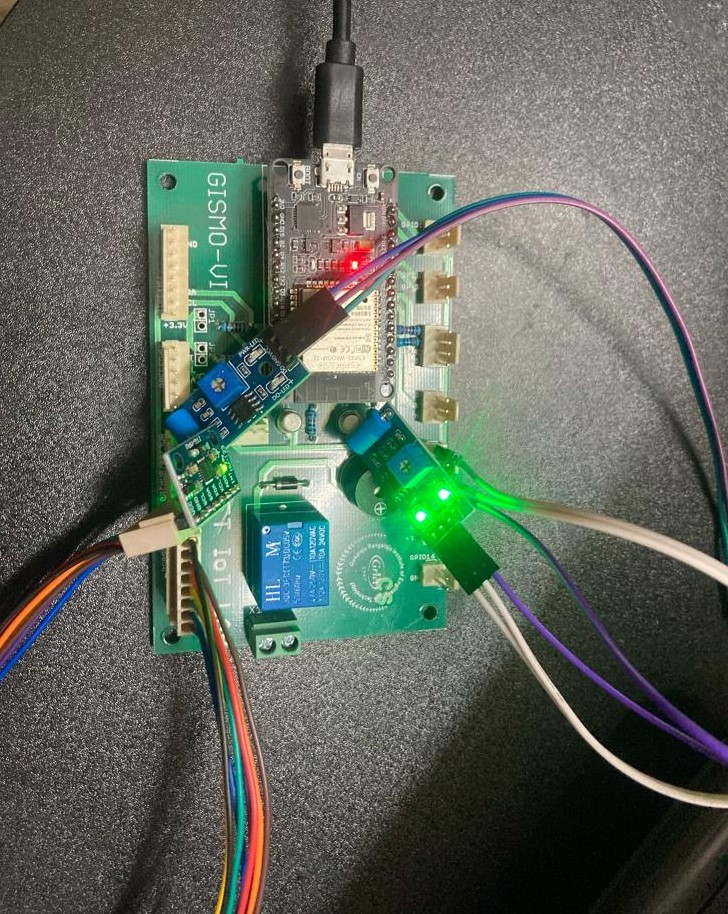
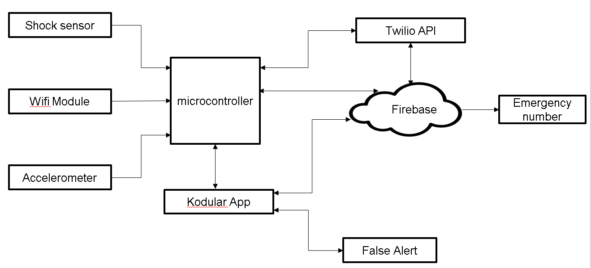
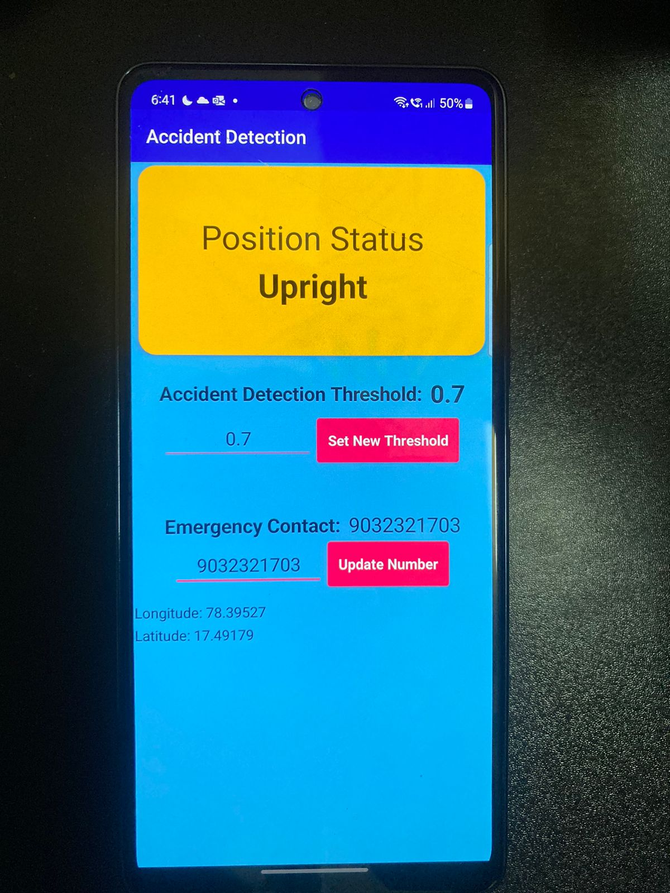
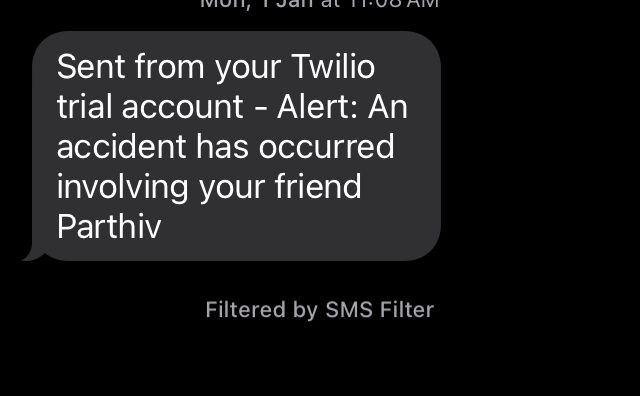
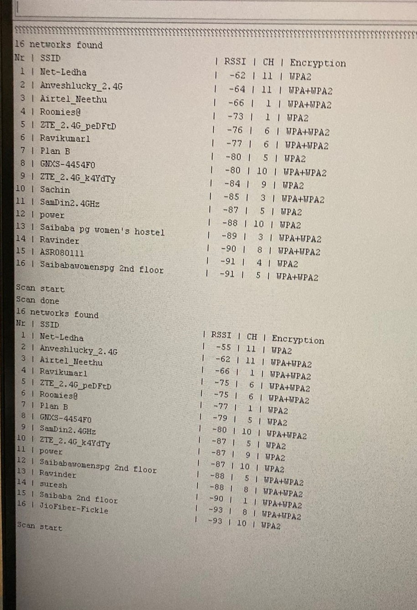

# Accident Detection and Rescue Alert System using IoT

## Description

This repository contains the program and the project files that can be used to deploy the Accident Detection and Rescue Alert System using IoT. It uses a GISMO-VI ESP-32 microcontroller paired with the MPU6050 accelerometer to detect a crash, Firebase to store the data related to crash and emergency contacts, and an Android app designed using Kodular to send the crash alert as well as allow users to edit their details.

## Developer Usage

### Phase 1: Downloading Arduino IDE

1. Go to [this link](https://www.arduino.cc/en/software).
2. Download **Windows 10 and newer (64 bits)**.
3. Install the IDE using the setup file.

### Phase 2: Setting up IDE

1. Go to `File` ➔ `Preferences`.
2. Enter [this URL](https://dl.espressif.com/dl/package_esp32_index.json) into the _Additional Boards Manager URLs:_ dialog box.
3. Go to `Tools` ➔ `Boards` ➔ `Boards Manager`.
4. Type **ESP32** and install _esp32_ by _Espressif Systems_.

_Note: Install the respective libraries given in `GISMO6-Docs/Introduction.pptx`_

### Phase 3: Programming ESP32 with Arduino

1. Connect the ESP32 module after connecting all the necessary sensors for the program.
2. Go to `Tools` ➔ `Boards` and select _ESP32 Dev Module_ (if a dialog for the USB port opens, set the Board to _ESP32 Dev Module_ right there).
3. If the port is not set yet, go to `Tools` ➔ `Port` ➔ `COMX`.

_Note: Serial Monitor should be set to 115200 baud for serial messages._

### Phase 4: Importing `.aia` file in Kodular

1. Open [Kodular Creator](https://creator.kodular.io).
2. If the project is not already imported, click on **Import Project** and upload the `.aia` file.

### Phase 5: Connecting Kodular to Firebase

1. Copy the Firebase URL into **Firebase URL** (including `https://`) in the Firebase component.
2. Copy the Firebase secret into **Firebase Token** in the Firebase component.

_Note: After installing libraries for Firebase and OLED Display, delete the folder `C:\Users\%USERNAME%\AppData\Local\Arduino15\libraries`._
